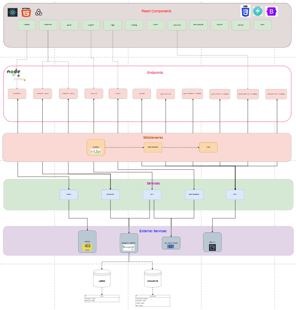
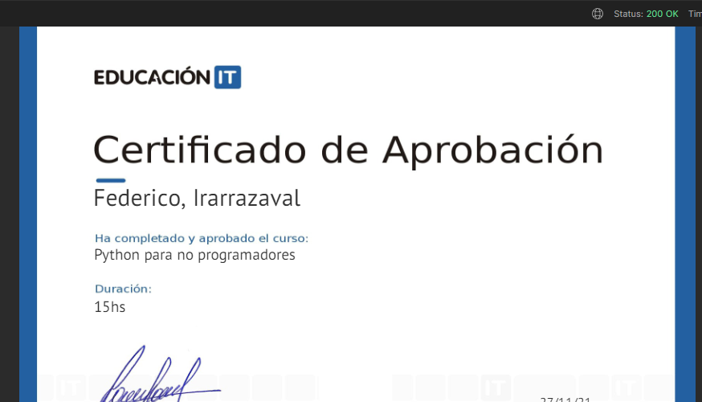

# PORTFOLIO - FULL-STACK DIGITAL PRESENCE PLATFORM

### 📚 Technical Documentation

- [Project Structure](#project-structure)
- [Architecture](#architecture)
- [Tech Stack](#tech-stack)
- [Installation](#installation)
- [Environment Variables](#environment-variables)
- [Running the Project](#running-the-project)

### 🔧 Backend & Frontend

- [API Endpoints](#api-endpoints)
- [Error Handling](#error-handling)
- [FRONTEND - UX Reactiva y State Management Enterprise](#frontend---ux-reactiva-y-state-management-enterprise)
- [Theming & Styling - Sistema Escalable](#theming--styling---sistema-escalable)

### 📝 Legales y Autor

- [License](#license)
- [Author & Leadership Profile](#author--leadership-profile)
- [Portfolio pictures](#portfolio-pictures)

## Project Structure

Below is the organized structure of folders and files in the project:

```
PORTFOLIOFI
├── docker-compose.yml
├── api
│    ├── src
│    │   ├── config
│    │   │    └── config.js
│    │   ├── db
│    │   │    ├── schemas
│    │   │    │      ├── comment.js
│    │   │    │      └── user.js
│    │   │    └── db.js
│    │   ├── middlewares
│    │   │    ├── authentication.middleware.js
│    │   │    ├── error.middleware.js
│    │   │    ├── passport.middleware.js
│    │   │    └── validator.middleware.js
│    │   ├── routes
│    │   │     ├── comments.routes.js
│    │   │     ├── email.routes.js
│    │   │     ├── files.routes.js
│    │   │     ├── user.routes.js
│    │   │     └── index.js
│    │   ├── schemasValidation
│    │   │        ├── comment.schema.js
│    │   │        ├── email.schema.js
│    │   │        └── user.schema.js
│    │   ├── services
│    │   │     ├── authentication
│    │   │     │      └── loginService.js
│    │   │     ├── comments
│    │   │     │      └── commentsService.js
│    │   │     ├── emails
│    │   │     │      └── emailService.js
│    │   │     ├── files
│    │   │     │      └── awsS3Service.js
│    │   │     └── user
│    │   │           └── userService.js
│    │   ├── utils/authenticationStrategies
│    │   │                  ├── jwt.strategy.js
│    │   │                  └── local.strategy.js
│    │   └── app.js
│    ├── uploads
│    │      └── ...
|    ├── Dockerfile
│    ├── index.js
│    ├── package.json
│    └── .env
└── client
     ├── public
     │    ├── index.html
     │    └── ...
     ├── src
     │   ├── actions
     │   │    └── ...
     │   ├── assets
     │   │    └── ...
     │   ├── components
     │   │    └── ...
     │   ├── reducer
     │   │    └── index.js
     │   ├── store
     │   │    └── index.js
     |   ├── utils
     │   │     ├── authentication
     │   │     │     └── refreshToken.js
     │   │     ├── comments
     │   │     │     └── ...
     │   │     ├── general
     │   │     |     └── chakraTheme.js
     │   │     └── index.js
     |   ├── App.js
     |   └── index.js
     ├── package.json
     └── .env
```

## Architecture

Below, an image the architecture of the project is shown:



## Tech Stack - Decisiones Arquitectónicas

### Backend: Escalabilidad y Seguridad

| Tecnología            | Rol                        | Justificación                                                                                                |
| --------------------- | -------------------------- | ------------------------------------------------------------------------------------------------------------ |
| **Node.js + Express** | Core API                   | Runtime event-driven para I/O escalable + framework minimalista que permite patrones de arquitectura limpios |
| **MongoDB Atlas**     | Persistencia               | Esquema flexible para evolución rápida + managed service (automatic backup, scaling)                         |
| **Mongoose**          | ODM                        | Validaciones de schema en aplicación + hooks para lógica transversal                                         |
| **JWT + Passport**    | Autenticación              | Stateless authentication escalable + soporte multi-estrategia (local, OAuth-ready)                           |
| **Joi + Boom**        | Validación/Errores         | Validación declarativa en entrada + mapeo consistente de errores a códigos HTTP semánticos                   |
| **Bcrypt**            | Hash de contraseñas        | Rounds configurables para adaptarse a poder computacional futuro                                             |
| **AWS S3**            | Almacenamiento de archivos | Escalabilidad ilimitada + integridad de data con versionado + CDN-ready                                      |
| **Docker**            | Infraestructura            | Reproducibilidad dev→prod + deployment sin fricción                                                          |

### Frontend: UX Reactiva y Mantenibilidad

| Tecnología        | Rol                | Justificación                                                                  |
| ----------------- | ------------------ | ------------------------------------------------------------------------------ |
| **React + Redux** | State Management   | Single source of truth predecible + debugging con Redux DevTools               |
| **Redux Persist** | Session Recovery   | Rehydration automática, sesión resiliente a refreshes                          |
| **Redux Thunk**   | Async Operations   | Middleware para operaciones asíncronas, manejo de race conditions              |
| **React Router**  | Routing            | SPA con URLs semánticas + nested routes para UX jerarquizada                   |
| **Chakra UI**     | Component Library  | Design system consistente + accesibilidad WCAG built-in + theming centralizado |
| **Framer Motion** | Animaciones        | Transiciones fluidas sin impacto en performance (GPU-accelerated)              |
| **Axios**         | HTTP Client        | Interceptores para auth headers + retry logic automático                       |
| **CSS Modules**   | Scoping de estilos | Evita colisiones CSS en componentes, mantenibilidad escalada                   |

## Installation

1. git clone https://github.com/FedeIra/Project-Portfolio.git

2. You can use branches master or develop.

## Environment Variables

Create a `.env` file in the root of the project and add the following environment variables. You can check for such purpose the `.env.example` file in the root of the project:

```bash
URL_DB=mongodb+srv://...
PORT=3001
EMAIL_JS_SERVICEID=email_js_service_id
EMAIL_JS_TEMPLATEID=email_js_template_id
EMAIL_JS_PUBLICKEY=email_js_public_key
EMAIL_JS_PRIVATEKEY=email_js_private_key
AWS_BUCKET_NAME=aws_bucket_name
AWS_BUCKET_REGION=aws_bucket_region
AWS_ACCESS_KEY=aws_access_key
AWS_SECRET_KEY=aws_secret_key
JWT_SECRET=secret_key
ADMIN_UPLOAD_KEY=admin_upload_key
```

## Running the Project

### Using Docker:

1. Create a `.env` as described previously.

2. Check Docker is installed and running on your machine.

3. Build and run the project using the following command in the root of the project directory:

```bash
docker-compose up --build
```

4. Else, you can run the backend and frontend separately using the following commands:

BACKEND (api directory)

```bash
docker build -t portfolio-backend .
docker run -p 3001:3001 --env-file .env portfolio-backend
```

FRONTED (client directory)

```bash
docker build -t portfolio-frontend .
docker run -p 3000:3000 --env-file .env portfolio-frontend
```

### Without Docker:

1. Create a `.env` as described previously.

2. Run either of following commands to start the server both in api and client directories:

```bash
npm install
npm run start
```

# BACKEND - API SEGURA Y ESCALABLE

## Arquitectura y Responsabilidades

Backend implementa una **arquitectura de capas** con separación clara de concerns: rutas, servicios, validaciones y persistencia. Esto asegura:

- **Autenticación de empresa-grade**: JWT + Passport con estrategias locales e integración preparada para OAuth
- **Validaciones de negocio en capas**: Joi schemas en entrada + reglas en servicios, garantizando integridad de datos
- **Manejo estructurado de errores**: Middleware centralizado con códigos HTTP correctos y mensajes claros (Boom library)
- **Gestión de archivos escalable**: Integración con AWS S3 para almacenamiento seguro de certificados con metadatos auditables
- **Persistencia flexible**: MongoDB con Mongoose ODM, diseño de schemas optimizado para crecimiento

## Endpoints - Operaciones Críticas

La API gestiona operaciones transaccionales:

- **Ciclo de usuario**: Registro con validación, login con token issuance, refresh automático de sesiones
- **Comunicación asíncrona**: Envío de emails con manejo de errores y logging
- **Gestión de credenciales**: CRUD completo de certificados con integridad de archivo y auditoría (metadata S3)

## API Endpoints

- Register user
  - URL: /sign-up
  - Method: POST
  - Body:

    ```json
    {
      "username": "username",
      "password": "password"
    }
    ```

Example of response:

```json
{
  "username": "username",
  "createdAt": "2024-07-03T14:17:10.797Z"
}
```

- Login user
  - URL: /login
  - Method: POST

  - Body:

```json
{
  "username": "username",
  "password": "password"
}
```

Example of response:

```json
{
  "token": "asdjklhfjksr234ihrfjkasdhfjkasdhf",
  "user": "username"
}
```

- Refresh user token
  - URL: /refresh-token
  - Method: POST

  - Body:

```json
{
  "token": "asdjklhfjks92s4ihrfjkasdhfjkasdhf"
}
```

Example of response:

```json
{
  "token": "asdjklhfjksr234ihrfjkasdhfjkasdhf"
}
```

- Send email
  - URL: /sendEmail
  - Method: POST
  - Body:

  ```json
  {
    "user_name": "user_name",
    "user_email": "user_email",
    "subject": "subject",
    "message": "message"
  }
  ```

  Example of response:

  ```json
  {
    "success": true,
    "message": "Email sent successfully"
  }
  ```

- Get all comments
  - URL: /comments
  - Method: GET
  - Body:

  Example of response:

  ```json
  [
    {
      "commentId": 0.8408903311723082,
      "username": "Ricky",
      "content": "Nice porfolio!",
      "date": "7-3-2024"
    },
    {
      "commentId": 0.7788864317317885,
      "username": "John",
      "content": "Great job!",
      "date": "7-3-2024"
    }
  ]
  ```

- Post comment
  - URL: /comments
  - Method: POST
  - Authorization Header:

    ```json
      Bearer Token <token>
    ```

  - Body:

  ```json
  {
    "commentId": 123521353145,
    "username": "username",
    "content": "content",
    "date": "7-01-2024"
  }
  ```

  Example of response:

  ```json
  {
    "commentId": 123521353145,
    "username": "username",
    "content": "content",
    "date": "7-01-2024"
  }
  ```

- Upload new certificate
  - URL: /upload
  - Method: POST

  - Body: Form data with file (key: file)

  Example of response:

  ```json
  {
    "$metadata": {
      "httpStatusCode": 200,
      "requestId": "12397612893asddf",
      "extendedRequestId": "asdlmfnlasjkdnfjksdnflmsdf==",
      "attempts": 1,
      "totalRetryDelay": 0
    },
    "ETag": "\"sxdkjlhf9rfksdhf\"",
    "ServerSideEncryption": "HJS914",
    "VersionId": "askldjhfjkslhafjklashf"
  }
  ```

- Get all certificates data
  - URL: /getListFiles
  - Method: GET
  - Authorization Header:

    ```json
      Bearer Token <token>
    ```

  Example of response:

  ```json
  [
    {
      "key": "Certificado Platzi. Fundamentos de Typescript.pdf",
      "size": 460788,
      "lastModified": "2023-12-14T18:39:56.000Z",
      "storageClass": "STANDARD"
    },
    {
      "key": "Certificado Platzi. Introducción a la nube..pdf",
      "size": 449571,
      "lastModified": "2024-06-25T17:36:15.000Z",
      "storageClass": "STANDARD"
    }
  ]
  ```

- Get specific certificate data
  - URL: /getFileData/:fileName
  - Method: GET
  - Authorization Header:

    ```json
      Bearer Token <token>
    ```

  - Params:

    ```json
    {
      "fileName": "Certificado Platzi. Fundamentos de Typescript.pdf"
    }
    ```

  Example of response:

  ```json
  {
    "httpStatusCode": 200,
    "requestId": "sdkfh3498trj",
    "extendedRequestId": "sadklfjskldjfklsdjf==",
    "attempts": 1,
    "totalRetryDelay": 0
  }
  ```

- Get certificate url
  - URL: /getFileUrl/:fileName
  - Method: GET
  - Authorization Header:

    ```json
      Bearer Token <token>
    ```

  - Params:

    ```json
    {
      "fileName": "Certificado Platzi. Fundamentos de Typescript.pdf"
    }
    ```

  Example of response:

  ```json
  {
    "url": "https://example-example.s3.us-east-1.amazonaws.com/example"
  }
  ```

- Download certificate file
  - URL: /downloadFile/:fileName
  - Method: GET
  - Authorization Header:

    ```json
      Bearer Token <token>
    ```

  - Params:

    ```json
    {
      "fileName": "Certificado Platzi. Fundamentos de Typescript.pdf"
    }
    ```

  Example of response:



- Delete certificate
  - URL: /deleteFile/:fileName
  - Method: DELETE
  - Authorization Header:

  ```json
    Bearer Token <token>
  ```

- Params:

  ```json
  {
    "fileName": "Certificado Platzi. Fundamentos de Typescript.pdf"
  }
  ```

Example of response:

```json
{
  "$metadata": {
    "httpStatusCode": 204,
    "requestId": "ASGEWRHGeRG",
    "extendedRequestId": "sdfgDFGwergdfGEDWRSGwerg=",
    "attempts": 1,
    "totalRetryDelay": 0
  },
  "DeleteMarker": true,
  "VersionId": "sdfsadFSAFASFASDFsad"
}
```

## Error Handling

Errors as well as validations are handled by middleware "error.middleware.js".

The middleware is used to catch errors and send a response with the corresponding status code and error message.

Moreover, errors are handled with Joi and Boom libraries. Joi for validation and Boom for error handling.

Examples of error responses (bad request and internal error) are shown below.

```json
{
  "statusCode": 400,
  "error": "Bad Request",
  "message": "Date is required. \"asd\" is not allowed"
}
```

```json
{
  "statusCode": 500,
  "error": "Internal Server Error",
  "message": "Error sending email: incorrect service id key."
}
```

## FRONTEND - UX REACTIVA Y STATE MANAGEMENT ENTERPRISE

### Arquitectura de Componentes y Estado

Frontend implementa un **modelo de state management centralizado** (Redux + Redux Thunk) que asegura:

- **Single Source of Truth**: Redux store con persistencia (Redux Persist) garantiza consistencia de datos y rehydration automática entre sesiones
- **Flujos de datos predecibles**: Actions y reducers estructurados por dominio (autenticación, comentarios, certificados)
- **Token lifecycle management**: Refresh automático de JWT al cargar la aplicación, manejo de expiración sin interrumpir UX
- **Componentes reutilizables**: Arquitectura modular basada en carpetas (cada componente = carpeta con lógica + estilos + subcomponentes)

### Estructura Técnica

- **Actions**: Lógica de dispatch (autenticación, comentarios, gestión de archivos) con Redux Thunk para operaciones asíncronas
- **Reducer**: Manejo centralizado de cambios de estado con validaciones y transformaciones de datos
- **Store**: Configuración con Redux Persist para session recovery automática
- **Components**: +20 componentes reutilizables con props bien definidas y manejo de errores granular
- **Utils**: Estrategias de autenticación, helpers de validación, y tema customizado de Chakra UI

### Experiencia del Usuario

- **Animaciones fluidas**: Framer Motion para transiciones y microinteracciones (modal entrances, loading states)
- **Diseño accesible**: Chakra UI como base (componentes con WCAG compliance)
- **Validaciones en tiempo real**: Feedback inmediato con Toast notifications (Chakra UI)
- **Theming dinámico**: Sistema de tema centralizado que soporte múltiples variantes de color sin refactor

## Theming & Styling - Sistema Escalable

**Chakra UI theming** centralizado (`src/utils/chakraTheme.js`):

- Colores, tipografía y espaciado definidos en un único punto de verdad
- Soporte para múltiples variantes sin tocar componentes
- **CSS Modules** para componentes con necesidades de estilo específicas (scoping automático)
- **Framer Motion** para animaciones de producción (modal transitions, loading states, scroll effects)

Esta estructura permite **pivots visuales sin refactoring masivo** — cambiar tema corporativo es un cambio en configuración.

## Error Handling - Resiliencia de Usuario

**Backend**: Middleware centralizado (`error.middleware.js`) que mapea errores a códigos HTTP semánticos y mensajes claros. Joi + Boom para validación y estructura de errores.

**Frontend**: Try-catch granular + Toast notifications (Chakra UI) que mantienen al usuario informado sin interrumpir flujos. Recuperación automática de errores transientes (timeout, network).

## License

This project is licensed under the MIT License. See the [LICENSE](./doc/LICENSE.txt) file for details.

## Portfolio pictures


