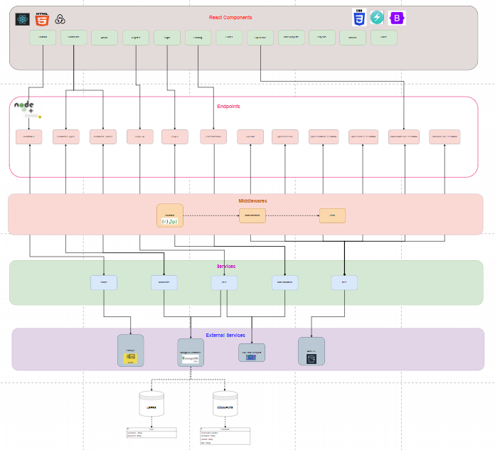

# PORTFOLIO

This a full-stack portfolio application that allows users to register, login, send emails, post comments, view and download courses certificates and, of course, get to know me better.

## Table of Contents

- [Project Structure](#project-structure)
- [Architecture](#architecture)
- [Tech Stack](#tech-stack)
- [Installation](#installation)
- [Environment Variables](#environment-variables)
- [Running the Project](#running-the-project)
- [BACKEND](#backend)
- [API Endpoints](#api-endpoints)
- [Error Handling](#error-handling)
- [FRONTEND](#frontend)
- [Main directories and files](#main-directories-and-files)
- [Theming and Styling](#theming-and-styling)
- [Error Handling](#error-handling)
- [License](#license)
- [Author](#author)
- [Portfolio pictures](#portfolio-pictures)

## Project Structure

Below is the organized structure of folders and files in the project:

```
PORTFOLIOFI
├── docker-compose.yml
├── api
│    ├── src
│    │   ├── config
│    │   │    └── config.js
│    │   ├── db
│    │   │    ├── schemas
│    │   │    │      ├── comment.js
│    │   │    │      └── user.js
│    │   │    └── db.js
│    │   ├── middlewares
│    │   │    ├── authentication.middleware.js
│    │   │    ├── error.middleware.js
│    │   │    ├── passport.middleware.js
│    │   │    └── validator.middleware.js
│    │   ├── routes
│    │   │     ├── comments.routes.js
│    │   │     ├── email.routes.js
│    │   │     ├── files.routes.js
│    │   │     ├── user.routes.js
│    │   │     └── index.js
│    │   ├── schemasValidation
│    │   │        ├── comment.schema.js
│    │   │        ├── email.schema.js
│    │   │        └── user.schema.js
│    │   ├── services
│    │   │     ├── authentication
│    │   │     │      └── loginService.js
│    │   │     ├── comments
│    │   │     │      └── commentsService.js
│    │   │     ├── emails
│    │   │     │      └── emailService.js
│    │   │     ├── files
│    │   │     │      └── awsS3Service.js
│    │   │     └── user
│    │   │           └── userService.js
│    │   ├── utils/authenticationStrategies
│    │   │                  ├── jwt.strategy.js
│    │   │                  └── local.strategy.js
│    │   └── app.js
│    ├── uploads
│    │      └── ...
|    ├── Dockerfile
│    ├── index.js
│    ├── package.json
│    └── .env
└── client
     ├── public
     │    ├── index.html
     │    └── ...
     ├── src
     │   ├── actions
     │   │    └── ...
     │   ├── assets
     │   │    └── ...
     │   ├── components
     │   │    └── ...
     │   ├── reducer
     │   │    └── index.js
     │   ├── store
     │   │    └── index.js
     |   ├── utils
     │   │     ├── authentication
     │   │     │     └── refreshToken.js
     │   │     ├── comments
     │   │     │     └── ...
     │   │     ├── general
     │   │     |     └── chakraTheme.js
     │   │     └── index.js
     |   ├── App.js
     |   └── index.js
     ├── package.json
     └── .env
```

## Architecture

Below, an image the architecture of the project is shown:



## Tech Stack

#### Backend stack

- **Node.js**: JavaScript runtime built on Chrome's V8 JavaScript engine.
- **Javascript**: High-level, interpreted programming language.
- **Express**: A minimal and flexible Node.js web application framework that provides a robust set of features for web and mobile applications.
- **MongoDB**: A NoSQL database that stores data in flexible, JSON-like documents. For this project im using MongoDB Atlas. MongoDB Atlas is a fully managed cloud database service.
- **Mongoose**: A MongoDB object modeling tool designed to work in an asynchronous environment.
- **Docker**: A platform for developing, shipping, and running applications in containers.
- **JWT and Passport**: JSON Web Token (JWT) is an open standard that defines a compact and self-contained way for securely transmitting information between parties as a JSON object. Passport is Express-compatible authentication middleware for Node.js.
- **Email.js**: A Node.js module for sending emails.
- **AWS S3**: Amazon Simple Storage Service (Amazon S3) is an object storage service that offers industry-leading scalability, data availability, security, and performance.
- **Joi and Boom**: Joi is a powerful schema description language and data validator for JavaScript. Boom is a set of utilities for returning HTTP errors.
- **Bcrypt**: A library to help you hash passwords.
- **Docker**: A platform for developing, shipping, and running applications in containers.

#### Frontend stack

- **Javascript**: High-level, interpreted programming language.
- **React**: A JavaScript library for building user interfaces.
- **Redux**: A predictable state container for JavaScript apps.
- **Redux Thunk**: A middleware for Redux to handle asynchronous actions.
  **Redux Persist**: A library to persist and rehydrate a redux store.
- **React Router**: A collection of navigational components for React applications.
- **Chakra UI**: A simple, modular, and accessible component library that gives you the building blocks you need to build your React applications.
- **Axios**: A promise-based HTTP client for the browser and Node.js.
- **Framer Motion**: A production-ready motion library for React.
- **React Bootstrap**: Bootstrap rebuilt for React.

## Installation

1. git clone https://github.com/FedeIra/Project-Portfolio.git

2. You can use branches master or develop.

## Environment Variables

Create a `.env` file in the root of the project and add the following environment variables. You can check for such purpose the `.env.example` file in the root of the project:

```bash
URL_DB=mongodb+srv://...
PORT=3001
EMAIL_JS_SERVICEID=email_js_service_id
EMAIL_JS_TEMPLATEID=email_js_template_id
EMAIL_JS_PUBLICKEY=email_js_public_key
EMAIL_JS_PRIVATEKEY=email_js_private_key
AWS_BUCKET_NAME=aws_bucket_name
AWS_BUCKET_REGION=aws_bucket_region
AWS_ACCESS_KEY=aws_access_key
AWS_SECRET_KEY=aws_secret_key
JWT_SECRET=secret_key
```

## Running the Project

### Using Docker:

1. Create a `.env` as described previously.

2. Check Docker is installed and running on your machine.

3. Build and run the project using the following command in the root of the project directory:

```bash
docker-compose up --build
```

4. Else, you can run the backend and frontend separately using the following commands:

BACKEND (api directory)

```bash
docker build -t portfolio-backend .
docker run -p 3001:3001 --env-file .env portfolio-backend
```

FRONTED (client directory)

```bash
docker build -t portfolio-frontend .
docker run -p 3000:3000 --env-file .env portfolio-frontend
```

### Without Docker:

1. Create a `.env` as described previously.

2. Run either of following commands to start the server both in api and client directories:

```bash
npm install
npm run start
```

# BACKEND

The API build with provides endpoints to:

- register user,
- login user,
- refresh user token,
- send email,
- get all comments,
- post comments,
- upload new certificate,
- get all certificates data,
- get specific certificate data,
- get certificate url,
- download certificate file, and
- delete certificate.

## API Endpoints

- Register user

  - URL: /sign-up
  - Method: POST
  - Body:

    ```json
    {
      "username": "username",
      "password": "password"
    }
    ```

Example of response:

```json
{
  "username": "username",
  "createdAt": "2024-07-03T14:17:10.797Z"
}
```

- Login user

  - URL: /login
  - Method: POST

  - Body:

```json
{
  "username": "username",
  "password": "password"
}
```

Example of response:

```json
{
  "token": "asdjklhfjksr234ihrfjkasdhfjkasdhf",
  "user": "username"
}
```

- Refresh user token

  - URL: /refresh-token
  - Method: POST

  - Body:

```json
{
  "token": "asdjklhfjks92s4ihrfjkasdhfjkasdhf"
}
```

Example of response:

```json
{
  "token": "asdjklhfjksr234ihrfjkasdhfjkasdhf"
}
```

- Send email

  - URL: /sendEmail
  - Method: POST
  - Body:

  ```json
  {
    "user_name": "user_name",
    "user_email": "user_email",
    "subject": "subject",
    "message": "message"
  }
  ```

  Example of response:

  ```json
  {
    "success": true,
    "message": "Email sent successfully"
  }
  ```

- Get all comments

  - URL: /comments
  - Method: GET
  - Body:

  Example of response:

  ```json
  [
    {
      "commentId": 0.8408903311723082,
      "username": "Ricky",
      "content": "Nice porfolio!",
      "date": "7-3-2024"
    },
    {
      "commentId": 0.7788864317317885,
      "username": "John",
      "content": "Great job!",
      "date": "7-3-2024"
    }
  ]
  ```

- Post comment

  - URL: /comments
  - Method: POST
  - Authorization Header:

    ```json
      Bearer Token <token>
    ```

  - Body:

  ```json
  {
    "commentId": 123521353145,
    "username": "username",
    "content": "content",
    "date": "7-01-2024"
  }
  ```

  Example of response:

  ```json
  {
    "commentId": 123521353145,
    "username": "username",
    "content": "content",
    "date": "7-01-2024"
  }
  ```

- Upload new certificate

  - URL: /upload
  - Method: POST

  - Body: Form data with file (key: file)

  Example of response:

  ```json
  {
    "$metadata": {
      "httpStatusCode": 200,
      "requestId": "12397612893asddf",
      "extendedRequestId": "asdlmfnlasjkdnfjksdnflmsdf==",
      "attempts": 1,
      "totalRetryDelay": 0
    },
    "ETag": "\"sxdkjlhf9rfksdhf\"",
    "ServerSideEncryption": "HJS914",
    "VersionId": "askldjhfjkslhafjklashf"
  }
  ```

- Get all certificates data

  - URL: /getListFiles
  - Method: GET
  - Authorization Header:

    ```json
      Bearer Token <token>
    ```

  Example of response:

  ```json
  [
    {
      "key": "Certificado Platzi. Fundamentos de Typescript.pdf",
      "size": 460788,
      "lastModified": "2023-12-14T18:39:56.000Z",
      "storageClass": "STANDARD"
    },
    {
      "key": "Certificado Platzi. Introducción a la nube..pdf",
      "size": 449571,
      "lastModified": "2024-06-25T17:36:15.000Z",
      "storageClass": "STANDARD"
    }
  ]
  ```

- Get specific certificate data

  - URL: /getFileData/:fileName
  - Method: GET
  - Authorization Header:

    ```json
      Bearer Token <token>
    ```

  - Params:

    ```json
    {
      "fileName": "Certificado Platzi. Fundamentos de Typescript.pdf"
    }
    ```

  Example of response:

  ```json
  {
    "httpStatusCode": 200,
    "requestId": "sdkfh3498trj",
    "extendedRequestId": "sadklfjskldjfklsdjf==",
    "attempts": 1,
    "totalRetryDelay": 0
  }
  ```

- Get certificate url

  - URL: /getFileUrl/:fileName
  - Method: GET
  - Authorization Header:

    ```json
      Bearer Token <token>
    ```

  - Params:

    ```json
    {
      "fileName": "Certificado Platzi. Fundamentos de Typescript.pdf"
    }
    ```

  Example of response:

  ```json
  {
    "url": "https://example-example.s3.us-east-1.amazonaws.com/example"
  }
  ```

- Download certificate file

  - URL: /downloadFile/:fileName
  - Method: GET
  - Authorization Header:

    ```json
      Bearer Token <token>
    ```

  - Params:

    ```json
    {
      "fileName": "Certificado Platzi. Fundamentos de Typescript.pdf"
    }
    ```

  Example of response:


- Delete certificate

  - URL: /deleteFile/:fileName
  - Method: DELETE
  - Authorization Header:

  ```json
    Bearer Token <token>
  ```

- Params:

  ```json
  {
    "fileName": "Certificado Platzi. Fundamentos de Typescript.pdf"
  }
  ```

Example of response:

```json
{
  "$metadata": {
    "httpStatusCode": 204,
    "requestId": "ASGEWRHGeRG",
    "extendedRequestId": "sdfgDFGwergdfGEDWRSGwerg=",
    "attempts": 1,
    "totalRetryDelay": 0
  },
  "DeleteMarker": true,
  "VersionId": "sdfsadFSAFASFASDFsad"
}
```

## Error Handling

Errors as well as validations are handled by middleware "error.middleware.js".

The middleware is used to catch errors and send a response with the corresponding status code and error message.

Moreover, errors are handled with Joi and Boom libraries. Joi for validation and Boom for error handling.

Examples of error responses (bad request and internal error) are shown below.

```json
{
  "statusCode": 400,
  "error": "Bad Request",
  "message": "Date is required. \"asd\" is not allowed"
}
```

```json
{
  "statusCode": 500,
  "error": "Internal Server Error",
  "message": "Error sending email: incorrect service id key."
}
```

## FRONTEND

The frontend of this project is built using React and Redux to provide a seamless user interface for interacting with the backend API. It allows users to register, login, post comments, upload and manage certificates, and more.

Below, you can see an image of the state of the application as example:


## Main directories and files

Frontend main directories are as follows:

- **Actions**: Contains all the actions that are dispatched to the Redux store. These actions are used to update the state of the application.
- **Assets**: Contains most of the images and icons used in the project.
- **Components**: Contains all the reusable components used in the project. These components are used to build the user interface. Each component is a separate folder that contains the component file and styles. Moreover, components may have subcomponents that are used to build the main component.
- **Reducer**: Contains the root reducer that handles react state updates.
- **Store**: Contains the store configuration. The store is where the application state is stored. The store is passed to the Provider component from react-redux, which makes the store available to all components in the application.
- **Utils**: Contains the utility functions used in the project. These functions are used to perform common tasks such as formatting dates, handling errors, and more. Utils folder contains document refreshToken.js, which is used to refresh the user token when it expires. For that purpose, every time website is loaded, refreshToken.js is called to check token expiration and refresh it if necessary.

The main files in the frontend are:

- **App.js**: The main component of the application. It contains the routes and the layout of the application.
- **Index.js**: The entry point of the application. It renders the App component and mounts it to the root element in the index.html file.

## Theming and Styling

The frontend is styled using Chakra UI's built-in theming system. The theme is defined in the theme.js file in the src/utils folder. The theme file contains the colors, fonts, and other styles used in the application. The theme is passed to the ChakraProvider component from Chakra UI, which makes the theme available to all components in the application.

Moreover, frontend uses Bootstrap for styling and layout for some components.

Finally, components also use CSS modules for styling. CSS modules are used to scope the styles to the component and prevent style conflicts.

For animation, the frontend uses Framer Motion, a production-ready motion library for React. Framer Motion is used to create smooth animations and transitions in the application.

## Error Handling

Errors are handled using try-catch blocks and displayed to the user using toast notifications from Chakra UI.

## License

This project is licensed under the MIT License. See the [LICENSE](./doc/LICENSE.txt) file for details.

## Author

Federico Irarrazaval

- LinkedIn: https://www.linkedin.com/in/federicoirarrazaval/?locale=en_US
- Email: fedeirar@gmail.com
- Portfolio: https://portfolio-fedeira.vercel.app/
- GitHub: https://github.com/FedeIra

## Portfolio pictures


